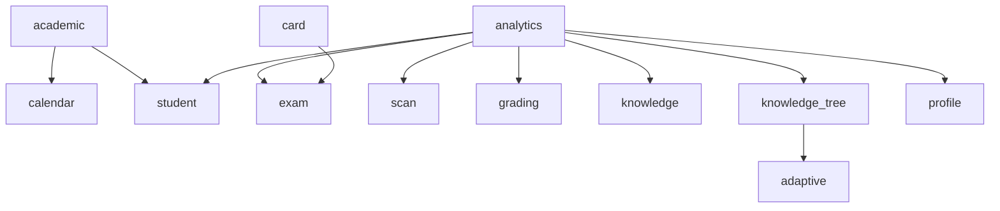

# edu-cloud 模块依赖图

> 自动生成，禁止手写。源：各模块 MODULE.md frontmatter。

```mermaid
flowchart TD
  academic --> calendar
  academic --> student
  analytics --> exam
  analytics --> scan
  analytics --> grading
  analytics --> student
  analytics --> knowledge
  analytics --> knowledge_tree
  analytics --> profile
  card --> exam
  knowledge_tree --> adaptive
```
