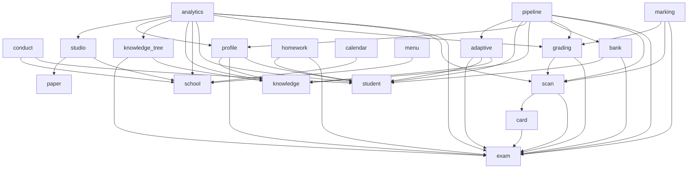

# edu-cloud 模块依赖图

> 自动生成，禁止手写。源：各模块 MODULE.md frontmatter。
> 最后更新：2026-05-05（21 模块 MODULE.md 补齐后重新生成）

```mermaid
flowchart TD
  conduct --> student
  conduct --> school
  grading --> exam
  grading --> scan
  marking --> exam
  marking --> scan
  marking --> grading
  pipeline --> exam
  pipeline --> scan
  pipeline --> grading
  pipeline --> bank
  pipeline --> knowledge
  pipeline --> profile
  pipeline --> student
  pipeline --> adaptive
  analytics --> exam
  analytics --> scan
  analytics --> grading
  analytics --> student
  analytics --> school
  analytics --> knowledge
  analytics --> knowledge_tree
  analytics --> profile
  analytics --> studio
  scan --> exam
  scan --> card
  card --> exam
  homework --> exam
  homework --> student
  knowledge_tree --> knowledge
  knowledge_tree --> exam
  studio --> school
  studio --> paper
  profile --> student
  profile --> exam
  profile --> knowledge
  bank --> exam
  bank --> student
  calendar --> school
  adaptive --> knowledge
  adaptive --> student
  adaptive --> exam
  menu --> school
```
